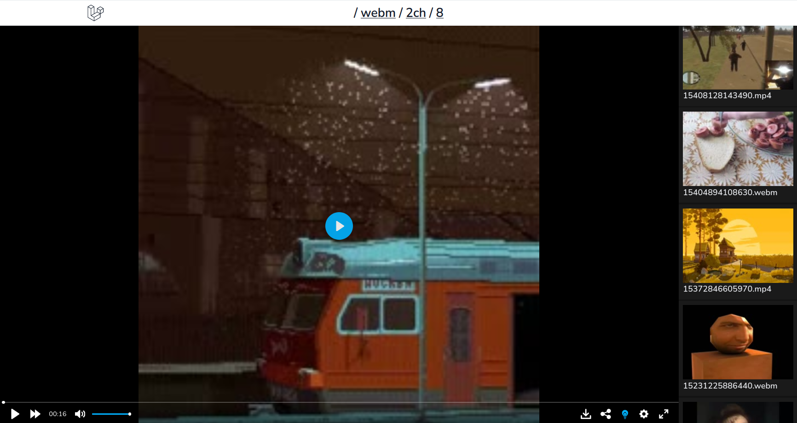

# Webm TV

Parses video files from imageboards, organizing it into a convenient video player.

## Features

* Supported websites:
    * https://2ch.hk
* Modern Youtube-like player based on https://plyr.io/
* Video duplication prevention based on hash and filename check
* Full-fledged playlist with thumbnails
* Download and share video URL
* Mobile-friendly UI
* Hotkeys
* Closed boards support (initial stage)

## Hosted At

https://webm-tv.com/

## Inspired By

* https://github.com/sasfmlzr/DvachMovie
* https://github.com/Karasiq/webm-tv

## Planned Features

* Personal view history based duplication prevention
* More websites to come
